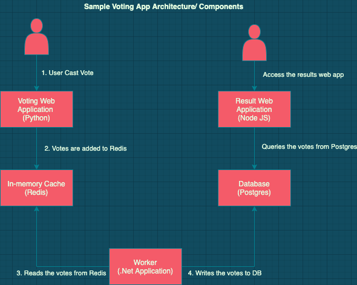

# kubernetes - Docker Sample
Hello, My name is Girish Jaju. This repository contains sample code, documents and instructions for Kubernetes related tutorials on my blog:
https://mycloudtutorials.com/

Linkedin: https://www.linkedin.com/in/girishjaju/

We will start off using the **docker commands** to deploy the sample voting application created and published by docker.

We will use the docker images available on docker hub, rather than build them from the source code.

**Application Architecture**

The application source code can be found at:
https://github.com/dockersamples/example-voting-app

This is a simple **multi tiered** voting application that uses different coding languages like Python, .Net and Node JS.

- A front-end web-app written in **Python** that let's you vote between 2 options (Cats / Dogs)
- A **Redis** in-memory caching layer that collects and queues the vote
- A Worker application written in .Net that consumes the votes and persist them on database
- A **Postgres** database backed by docker volume
- A **Node JS** webapp polling the database and showing the votes in real-time

**Our Task**

We need to take the containers and deploy them. We will do this in several steps:

Step1: We will deploy the docker images for this sample application and make it run locally.

Step2: Create the Kubernetes definition files and deploy the same application on a MiniKube single node environment locally.

Step3: Deploy to Amazon EKS with Load Balancer for both client facing application (voting and results)

**Prerequisites**
- Have docker installed locally
  Follow instructions from https://docs.docker.com/get-docker/

- Have an account at https://hub.docker.com/

- For local Kubernetes
  - Install Kubectl (Command line utility) 
    Follow instructions from: https://kubernetes.io/docs/tasks/tools/install-kubectl/ 

  - Install Minikube for running 1-node Kubernetes environment
    Following instructions from: https://minikube.sigs.k8s.io/docs/start/  

- For Deploying to EKS cluster on AWS:

  - AWS account setup with an user with Administrator access
    Follow instructions from: https://aws.amazon.com/free/
  
  - AWS Command Line is setup locally
    Follow instructions from: https://docs.aws.amazon.com/cli/latest/userguide/install-cliv2.html
  
  
  
  

